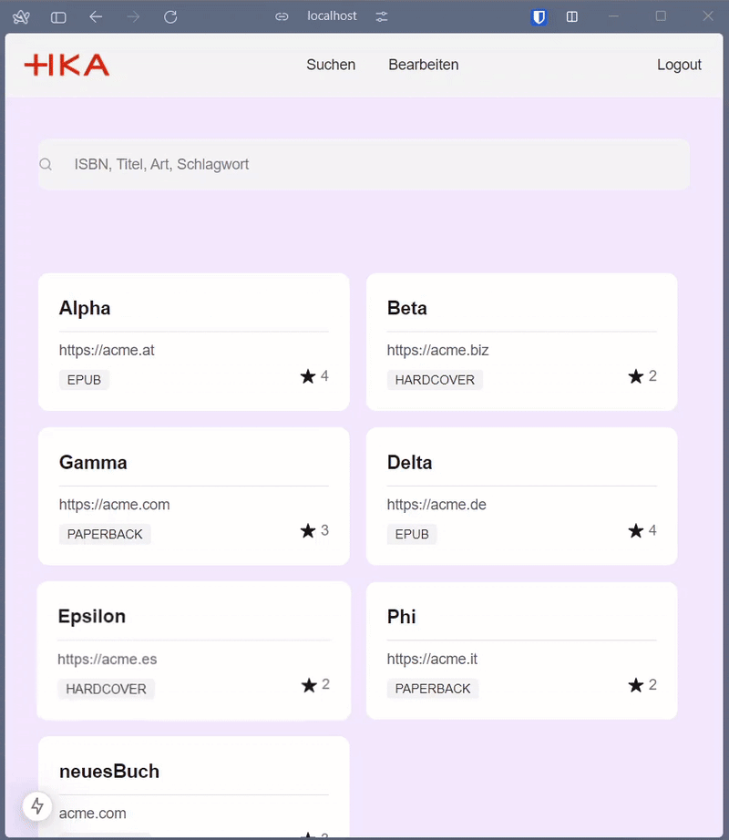

# Bücherei Management System

A Next.js web application for managing a digital library system with features for searching, editing, and managing books.

## Demo

### Book Search Feature


Watch how easily you can search for books using our tag-based filtering system:
- Type keywords to create search tags
- Filter by ISBN, title, type, or keywords
- Real-time search results
- Responsive card layout

## Getting Started

### Prerequisites

- Node.js (version 14.0 or higher)
- npm or yarn package manager
- Local GraphQL server running on port 3000 (HTTPS)

### Installation

1. Clone the repository:
```bash
git clone https://github.com/yourusername/buecherei.git
```

2. Install dependencies:
```bash
npm install
# or
yarn install
```

3. Run the development server:
```bash
npm run dev
# or
yarn dev
```

Open [http://localhost:3000](http://localhost:3000) in your browser to see the result.

## Project Structure

```
buecherei/
├── src/
│   ├── app/              # Next.js 13+ app directory
│   │   ├── api/         # API routes
│   │   ├── edit/        # Edit page
│   │   ├── search/      # Search page
│   │   └── layout.tsx   # Root layout
│   ├── components/      # React components
│   │   ├── Header/      # Navigation header
│   │   ├── ui/          # UI components
│   │   ├── booksearch.tsx
│   │   ├── edit.tsx
│   │   └── Login.tsx
│   └── types/          # TypeScript type definitions
├── public/             # Static files
└── styles/            # Global styles
```

## Features

- **Authentication**: Secure authentication using NextAuth.js with Keycloak integration
- **Book Search**: Advanced search functionality with tag-based filtering
- **Book Management**: Add and edit book entries
- **Responsive Design**: Built with Chakra UI components
- **GraphQL Integration**: Backend communication via GraphQL API

## Technologies Used

- Next.js 13+
- React
- TypeScript
- Chakra UI
- NextAuth.js
- BookServer (Backend Server)
- GraphQL
- React Icons
- React DatePicker

## API Routes

- `/api/books` - POST: Add new books to the system
- `/graphql` - GraphQL endpoint for book queries and mutations

## Authentication

The system uses a combination of NextAuth.js and Keycloak for authentication:
- Frontend session management with NextAuth.js
- Keycloak token handling in the backend
- Protected routes
- Secure credential handling

## Contributing

1. Fork the repository
2. Create your feature branch (`git checkout -b feature/AmazingFeature`)
3. Commit your changes (`git commit -m 'Add some AmazingFeature'`)
4. Push to the branch (`git push origin feature/AmazingFeature`)
5. Open a Pull Request

## License

This project is licensed under the MIT License - see the [LICENSE.md](LICENSE.md) file for details.
